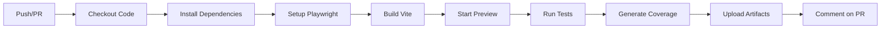

# 🚀 CI/CD Setup Guide - GitHub Actions

Complete guide to set up automated testing and coverage reporting with GitHub Actions.

## 📋 Table of Contents
- [Quick Start](#quick-start)
- [Workflows Overview](#workflows-overview)
- [Configuration Steps](#configuration-steps)
- [Coverage Badge Setup](#coverage-badge-setup)
- [Viewing Reports](#viewing-reports)
- [Troubleshooting](#troubleshooting)

## ⚡ Quick Start

### 1. Enable GitHub Actions

Your workflows are already configured! Just push to GitHub:

```bash
git add .github/
git commit -m "Add GitHub Actions workflows"
git push
```

The workflows will automatically:
- ✅ Run on every push
- ✅ Run on every pull request
- ✅ Run daily at 2 AM UTC
- ✅ Generate coverage reports
- ✅ Upload test artifacts

### 2. Check Workflow Status

1. Go to your GitHub repository
2. Click the **Actions** tab
3. See your workflows running!

## 📊 Workflows Overview

### Main Test Workflow (`test.yml`)

**Runs on:** Every push and pull request

**What it does:**


**Results:**
- Unit tests executed with Vitest
- E2E tests executed with Playwright
- Coverage reports generated
- Artifacts stored for 30 days
- PR comments with coverage summary

### Coverage Badge Workflow (`coverage-badge.yml`)

**Runs on:** Push to main/master/Dev-1 branches

**Creates:**
- Dynamic coverage badge
- Long-term coverage history
- Optional Codecov integration

### Scheduled Tests Workflow (`scheduled-tests.yml`)

**Runs on:** Daily at 2 AM UTC

**Purpose:**
- Regular health checks
- Long-term trend analysis
- Automatic issue creation on failure

## 🔧 Configuration Steps

### Step 1: Repository Permissions

1. Go to **Settings** → **Actions** → **General**
2. Under "Workflow permissions":
   - ✅ Select "Read and write permissions"
   - ✅ Check "Allow GitHub Actions to create and approve pull requests"
3. Click **Save**

### Step 2: Enable Issues (for failure notifications)

1. Go to **Settings** → **General**
2. Under "Features":
   - ✅ Enable "Issues"
3. Click **Save**

### Step 3: Test the Workflows

**Manual trigger:**
1. Go to **Actions** tab
2. Select "E2E Tests & Coverage" workflow
3. Click "Run workflow"
4. Select branch and click "Run workflow"

**Automatic trigger:**
```bash
git commit --allow-empty -m "Test GitHub Actions"
git push
```

## 🏅 Coverage Badge Setup (Optional)

Add a beautiful coverage badge to your README!

### Step 1: Create a Gist

1. Go to https://gist.github.com/
2. Create new gist:
   - **Filename:** `coverage-badge.json`
   - **Content:** `{}`
   - Make it **public**
3. Copy the Gist ID from the URL:
   ```
   https://gist.github.com/username/abc123def456
                                      ^^^^^^^^^^^^
                                      This is your Gist ID
   ```

### Step 2: Create GitHub Token

1. Go to **Settings** (your profile, not repo) → **Developer settings**
2. Click **Personal access tokens** → **Tokens (classic)**
3. Click **Generate new token (classic)**
4. Settings:
   - **Note:** `Coverage Badge`
   - **Expiration:** 90 days (or longer)
   - **Scopes:** ✅ `gist` only
5. Click **Generate token**
6. **Copy the token immediately** (you won't see it again!)

### Step 3: Add Secret to Repository

1. Go to your **repository** Settings → **Secrets and variables** → **Actions**
2. Click **New repository secret**
3. Create secret:
   - **Name:** `GIST_SECRET`
   - **Value:** Paste your token
4. Click **Add secret**

### Step 4: Update Workflow

Edit `.github/workflows/coverage-badge.yml`:

Find the line with:
```yaml
GIST_ID: 42917a0d58b49e567c96027d931cd95f  # Replace with your Gist ID
```

Replace with your actual Gist ID:
```yaml
GIST_ID: abc123def456  # Your Gist ID
```

Also update the `gistID` in the dynamic-badges-action step:
```yaml
gistID: abc123def456  # Your Gist ID
```

Commit and push:
```bash
git add .github/workflows/coverage-badge.yml
git commit -m "Configure coverage badge"
git push
```

### Step 5: Add Badge to README

Add to your `README.md`:

```markdown
# Your Project Name


Your project description...
```

Replace:
- `USERNAME` - Your GitHub username
- `REPO` - Your repository name
- `GIST_ID` - Your Gist ID from Step 1

## 📊 Viewing Reports

### After Each Workflow Run

1. Go to **Actions** tab
2. Click on a workflow run
3. Scroll to **Artifacts** section
4. Download available reports:

**Available Downloads:**
- `coverage-report-node-18.x` - Coverage HTML report (Node 18)
- `coverage-report-node-20.x` - Coverage HTML report (Node 20)
- `test-results-node-*` - Full test results
- `failure-screenshots-*` - Screenshots if tests failed

### Viewing Coverage HTML

1. Download artifact (e.g., `coverage-report-node-20.x`)
2. Unzip the file
3. Open `index.html` in your browser
4. Explore detailed line-by-line coverage!

### PR Coverage Comments

On pull requests, you'll automatically get a comment like:

```
## 📊 Test Coverage Report

| Metric | Coverage | Status |
|--------|----------|--------|
| Statements | 89.79% | ✅ |
| Branches | 71.42% | ⚠️ |
| Functions | 92.85% | ✅ |
| Lines | 89.79% | ✅ |

**Total Coverage:** 89.79%

📁 View detailed coverage report in artifacts
```

## 🎯 Workflow Customization

### Change Test Schedule

Edit `.github/workflows/scheduled-tests.yml`:

```yaml
schedule:
  # Daily at 2 AM UTC
  - cron: '0 2 * * *'
  
  # Or try these:
  # - cron: '0 0 * * 1'    # Weekly on Mondays
  # - cron: '0 0 1,15 * *' # Twice a month
  # - cron: '0 */6 * * *'  # Every 6 hours
```

Cron helper: https://crontab.guru/

### Change Node.js Versions

Edit `.github/workflows/test.yml`:

```yaml
strategy:
  matrix:
    node-version: [18.x, 20.x]  # Add or remove versions
```

### Adjust Artifact Retention

Edit any workflow:

```yaml
- uses: actions/upload-artifact@v4
  with:
    retention-days: 30  # Change to 7, 60, 90, etc.
```

### Add Environment Variables

Edit workflows to add env vars:

```yaml
- name: Run tests
  run: npm run test:coverage
  env:
    HEADLESS: true
    CI: true
    CUSTOM_VAR: value
```

## 🔐 Optional: Codecov Integration

For advanced coverage tracking and visualization:

### Step 1: Sign Up for Codecov

1. Go to https://codecov.io/
2. Sign in with GitHub
3. Add your repository
4. Copy the upload token

### Step 2: Add Codecov Token

1. Repository **Settings** → **Secrets and variables** → **Actions**
2. Click **New repository secret**
3. Create:
   - **Name:** `CODECOV_TOKEN`
   - **Value:** Your Codecov token
4. Click **Add secret**

### Step 3: Workflow is Ready!

The `coverage-badge.yml` workflow already includes Codecov integration.
It will automatically upload coverage when the token is present.

### Step 4: View on Codecov

1. Go to https://codecov.io/gh/USERNAME/REPO
2. See beautiful coverage visualizations!
3. Track coverage trends over time
4. Get PR coverage comparisons

## 🐛 Troubleshooting

### Workflow Not Running

**Check:**
1. Is GitHub Actions enabled? (Settings → Actions)
2. Did you push the workflow files?
3. Check the Actions tab for errors

**Fix:**
```bash
# Verify workflow files exist
ls -la .github/workflows/

# Force trigger
git commit --allow-empty -m "Trigger workflow"
git push
```

### Tests Failing in CI

**Common causes:**
1. Different Node.js version
2. Missing dependencies
3. Playwright browsers not installed
4. Preview server not starting
5. Timeout issues

**Debug:**
Add to workflow:
```yaml
- name: Debug
  run: |
    node --version
    npm --version
    npx playwright --version
    curl http://localhost:4173 || echo "Preview server not responding"
```

### Preview Server Not Starting

**Check:**
1. Build completes successfully
2. Port 4173 is available
3. Preview server starts without errors

**Fix:**
```yaml
- name: Build and verify
  run: |
    npm run build
    ls -la dist/  # Verify build output exists
```

### Coverage Badge Not Updating

**Check:**
1. Is `GIST_SECRET` configured?
2. Is Gist ID correct in workflow?
3. Did workflow complete successfully?
4. Is badge URL correct in README?

**Refresh:**
```markdown

                                                                                                               ^^^^^^^^^
                                                                                                     Add timestamp to force refresh
```

### Artifacts Not Appearing

**Verify:**
1. Workflow completed (green checkmark)
2. Upload step succeeded
3. Correct file paths

**Test locally:**
```bash
npm run test:coverage
ls -la coverage/  # Should see files
```

### Permission Denied Errors

**Fix repository permissions:**
1. Settings → Actions → General
2. Workflow permissions → Read and write
3. Save changes

### Playwright Issues

Already handled by workflow, but if issues persist:

```yaml
- name: Debug Playwright
  run: |
    npx playwright --version
    npx playwright install chromium --dry-run
```

## 📈 Best Practices

### 1. Monitor Workflow Runs

- Check Actions tab regularly
- Review failed runs immediately
- Monitor coverage trends

### 2. Keep Dependencies Updated

```yaml
# Dependabot will help (create .github/dependabot.yml)
version: 2
updates:
  - package-ecosystem: "npm"
    directory: "/"
    schedule:
      interval: "weekly"
  - package-ecosystem: "github-actions"
    directory: "/"
    schedule:
      interval: "weekly"
```

### 3. Set Up Notifications

1. Watch your repository
2. Enable email notifications
3. Consider Slack/Discord webhooks

### 4. Review Coverage Reports

- Download and review HTML reports
- Identify untested code
- Improve coverage over time

### 5. Use Protected Branches

1. Settings → Branches → Add rule
2. Require status checks to pass
3. Select your workflow

## 📚 Additional Resources

- [GitHub Actions Docs](https://docs.github.com/en/actions)
- [Workflow Syntax](https://docs.github.com/en/actions/using-workflows/workflow-syntax-for-github-actions)
- [Vitest Documentation](https://vitest.dev/)
- [Playwright Documentation](https://playwright.dev/)
- [Codecov Documentation](https://docs.codecov.com/)

## ✅ Checklist

Use this checklist to verify your setup:

- [ ] Workflows pushed to GitHub
- [ ] Actions tab shows workflows
- [ ] Workflow permissions configured
- [ ] Test workflow runs successfully
- [ ] Coverage artifacts generated
- [ ] PR comments working (create test PR)
- [ ] Coverage badge created (optional)
- [ ] Badge added to README (optional)
- [ ] Codecov integrated (optional)
- [ ] Scheduled tests running
- [ ] Team notified about CI/CD

## 🎉 Success!

Once everything is set up:

1. ✅ Every push triggers tests
2. ✅ Every PR shows coverage
3. ✅ Daily health checks run
4. ✅ Reports stored automatically
5. ✅ Coverage tracked over time
6. ✅ Failures create issues
7. ✅ Badge shows current status

**Your CI/CD pipeline is now complete!** 🚀

---

**Questions?** Check `.github/workflows/README.md` for detailed documentation.

